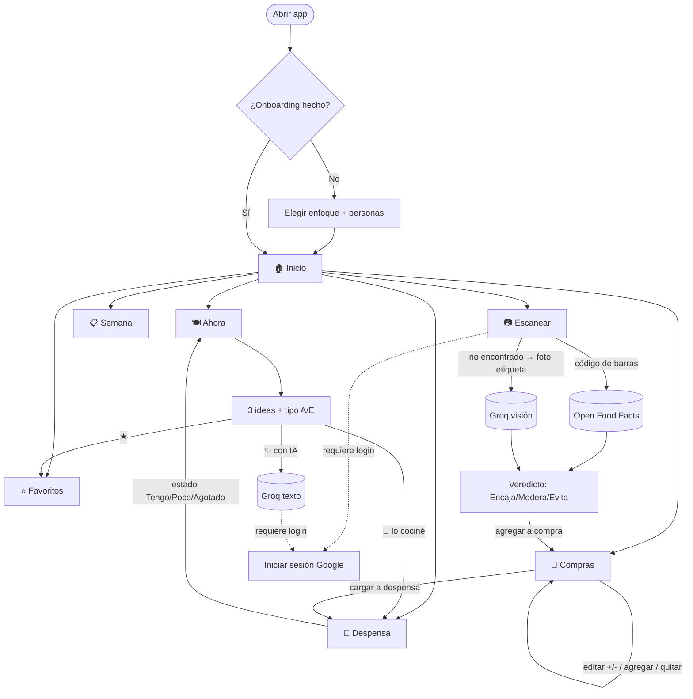
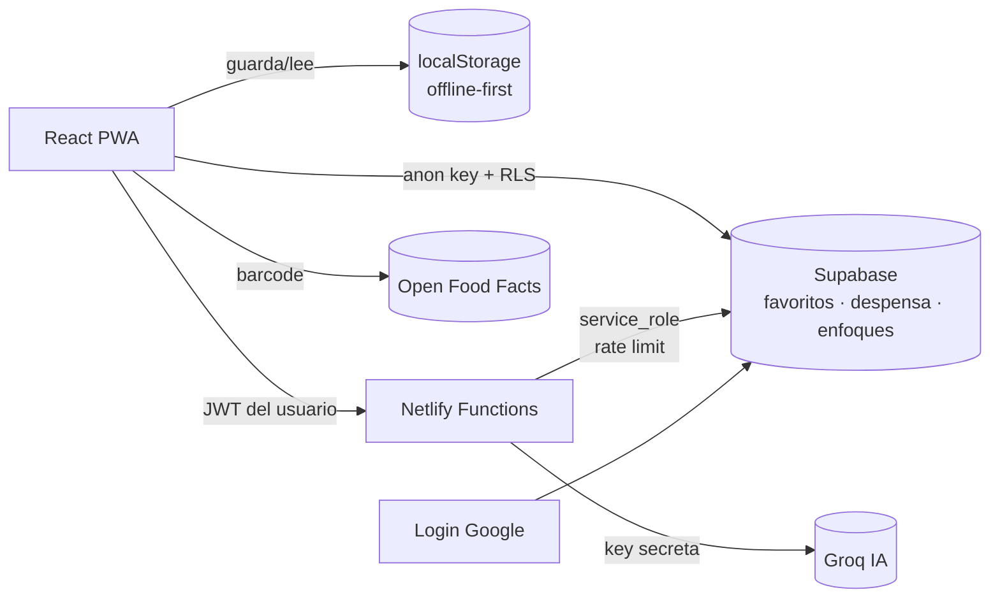
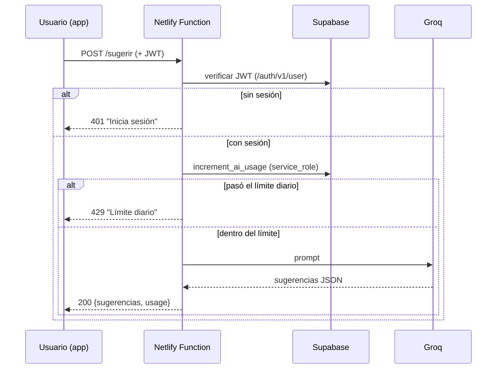

# Diagramas de flujo

> Se renderizan automáticamente en GitHub (Mermaid).

## 1. Flujo del usuario

```mermaid
flowchart TD
  A([Abrir app]) --> OB{¿Onboarding hecho?}
  OB -- No --> ON[Elegir enfoque + personas] --> H[🏠 Inicio]
  OB -- Sí --> H

  H --> AH[🍽 Ahora]
  H --> DE[🧺 Despensa]
  H --> CO[🛒 Compras]
  H --> FA[⭐ Favoritos]
  H --> SE[📋 Semana]
  H --> SC[📷 Escanear]

  AH --> S3[3 ideas + tipo A/E]
  S3 -->|✨ con IA| IA[(Groq texto)]
  S3 -->|★| FA
  S3 -->|🍳 lo cociné| DE

  CO -->|editar +/- / agregar / quitar| CO
  CO -->|cargar a despensa| DE
  DE -->|estado Tengo/Poco/Agotado| AH

  SC -->|código de barras| OFF[(Open Food Facts)]
  SC -->|no encontrado → foto etiqueta| VIS[(Groq visión)]
  OFF --> VER[Veredicto: Encaja/Modera/Evita]
  VIS --> VER
  VER -->|agregar a compra| CO

  SC -. requiere login .-> LOG[Iniciar sesión Google]
  IA -. requiere login .-> LOG
```

## 2. Flujo de datos

```mermaid
flowchart LR
  UI[React PWA] -- guarda/lee --> LS[(localStorage<br/>offline-first)]
  UI -- anon key + RLS --> SB[(Supabase<br/>favoritos · despensa · enfoques)]
  UI -- JWT del usuario --> FN[Netlify Functions]
  FN -- key secreta --> GROQ[(Groq IA)]
  FN -- service_role<br/>rate limit --> SB
  UI -- barcode --> OFF[(Open Food Facts)]
  LOGIN[Login Google] --> SB
```

## 3. Llamada de IA (gating + rate limit)

```mermaid
sequenceDiagram
  participant U as Usuario (app)
  participant F as Netlify Function
  participant S as Supabase
  participant G as Groq
  U->>F: POST /sugerir (+ JWT)
  F->>S: verificar JWT (/auth/v1/user)
  alt sin sesión
    F-->>U: 401 "Inicia sesión"
  else con sesión
    F->>S: increment_ai_usage (service_role)
    alt pasó el límite diario
      F-->>U: 429 "Límite diario"
    else dentro del límite
      F->>G: prompt
      G-->>F: sugerencias JSON
      F-->>U: 200 {sugerencias, usage}
    end
  end
```
