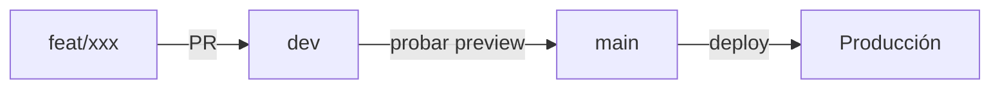

# Plan de desarrollo — features pendientes

> Roadmap de las ideas en `PROGRESO.md`, organizado en ramas `feat/*`.
> Flujo: `feat/xxx` → PR → `dev` (probar en URL preview) → PR → `main` (deploy prod).
> Última actualización: 2026-06-07

## Flujo de trabajo



```bash
git checkout dev && git pull          # partir siempre desde dev actualizado
git checkout -b feat/undo             # nueva feature
# ...trabajar, commits...
git push -u origin feat/undo          # abrir PR hacia dev en GitHub
```

**Reglas:**
- 1 rama `feat/` por idea. Nombre corto y claro.
- Nunca commit directo a `main`.
- Merge a `main` solo cuando `dev` está probado en su URL preview.
- Al terminar feature: marcar acá + mover idea a "Hecho" en `PROGRESO.md`.

---

## Fases (orden sugerido por valor/esfuerzo)

### Fase 0 — Fundación (antes de features)
| Rama | Qué | Por qué primero |
|------|-----|-----------------|
| `feat/tests-core` | Tests de `suggest`, `foodTypes`, `pantry`, `diets` | Red de seguridad antes de tocar lógica core en las demás features |

### Fase 1 — Quick wins (UX, bajo esfuerzo)
| Rama | Qué | Notas |
|------|-----|-------|
| `feat/undo` | Undo al quitar favorito y al "Lo cociné" | Toast con acción "Deshacer"; guardar estado previo en memoria |
| `feat/compartir-receta` | Compartir receta por link / WhatsApp | `navigator.share` nativo + fallback copiar link |
| `feat/bordes-rasgados` | Bordes rasgados reales en cards (filtro SVG) | Solo diseño, en `theme.js` / componente card |

### Fase 2 — Datos y nutrición
| Rama | Qué | Notas |
|------|-----|-------|
| `feat/macros` | Macros aproximadas por plato (proteína/grasa/carbo) | Sumar macros de ingredientes; datos en catálogo (`src/data/`) |
| `feat/historial-cocinado` | Historial "lo más cocinado" + priorizar en sugerencias | Tabla Supabase de eventos "cociné"; ranking influye en `suggest` |
| `feat/semana-combinada` | Semana que combine enfoques | Ampliar generador de semana para mezclar recetas de varios enfoques |

### Fase 3 — Escáner / integraciones externas
| Rama | Qué | Notas |
|------|-----|-------|
| `feat/cache-escaneo` | Caché de productos escaneados | Tabla Supabase; consultar antes de pegarle a Open Food Facts / IA |
| `feat/contrib-off` | Contribuir productos a Open Food Facts desde la app | API de escritura OFF; requiere credenciales OFF |
| `feat/smtp-email` | SMTP propio (Resend/Brevo) para magic-link | Reactiva login por email sin rate limit de Supabase |

---

## Estado

- [x] `dev` creada + branch deploys Netlify
- [x] Fase 0: `feat/tests-core` — Vitest + 76 tests (suggest/foodTypes/pantry/diets)
- [ ] Fase 1: `feat/undo` ✅, `feat/compartir-receta`, `feat/bordes-rasgados`
- [ ] Fase 2: `feat/macros`, `feat/historial-cocinado`, `feat/semana-combinada`
- [ ] Fase 3: `feat/cache-escaneo`, `feat/contrib-off`, `feat/smtp-email`
